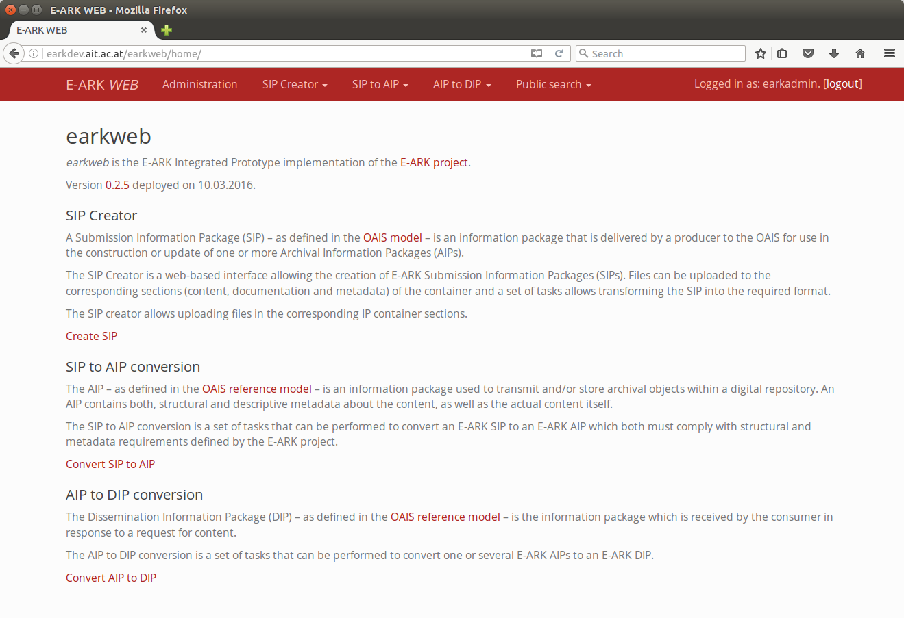

# earkweb

## Table of Contents

- [Instroduction](#instroduction)
- [Installation](#installation)
- [User guide](#user-guide)

## Instroduction

[E-ARK Web](https://github.com/eark-project/earkweb) is a web application with a task execution backend for synchronous and asynchronous processing of information packages.

E-ARK Web allows executing package transformations between the package formats SIP, AIP, and DIP, using [Celery](http://www.celeryproject.org), a distributed task queue, as its 
main backend. It provides a web interface to manage information package transformations. 

The backend can also be controlled via [remote command execution](./docs/user_guide_remotetask.md) without using the web frontend. The outcomes of operations performed by a task 
are stored immediately so that the status information in the frontend's database can be updated afterwards. 
 
The packaging format is using the [METS](http://www.loc.gov/standards/mets/) to represent the structure and the [PREMIS](http://www.loc.gov/standards/premis/) metadata format to 
record digital provenance information of the information package.

## Installation

* [Manual installation](./docs/install_manual.md) 
* [Installation based on Docker images](./docs/install_docker.md)
* [Installation as WSGI app (Apache Webserver frontend)](./docs/install_wsgi.md)
* [Developer notes](./docs/developer_notes.md)

## User guide

* [Web user interface guide](./docs/user_guide_webui.md)
* [Headless task execution (without gui)](./docs/user_guide_remotetask.md)
