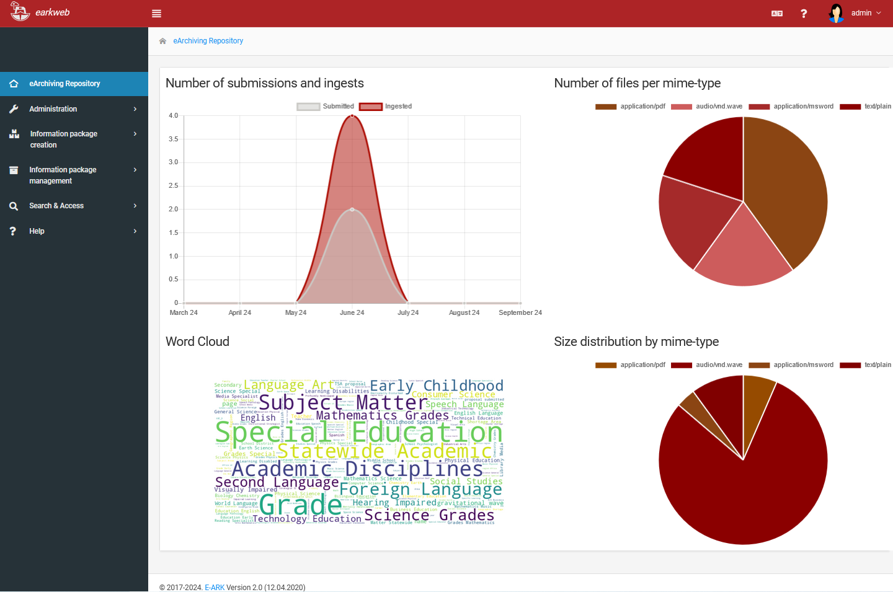

# earkweb

## Introduction

*earkweb* is a repository for archiving digital objects. It offers basic functions for ingest, management and 
dissemination of information packages. 

## Software architecture

*earkweb* is a web application with a  task execution backend based on 
[Celery](http://www.celeryproject.org) which supports the parallel processing of information. 

The following diagram illustrates the component architecture.

The user interface represented by the box on top of the diagram is a 
[Python](https://www.python.org)/[Django](https://www.djangoproject.com)-based web application which supports creation,
 management and exploration of information packages. Tasks can be assigned to Celery workers (green boxes with 
a "C") which share the same storage area and the result of the package transformation is stored in the information 
package’s working directory based on files. Full-text content included in information packages is indexed by SolR.
A [ResourceSync](http://www.openarchives.org/rs/toc) interface exposes the changelist of information packages managed 
by the repository.

## Installation

* [Manual installation](./docs/install_manual.md) 
* [Build and run using Docker](./docs/install_docker.md)
* [Installation as WSGI app (Apache Webserver frontend)](./docs/install_wsgi.md)

## User guide

* [Web user interface guide](./docs/user_guide_webui.md)
* [Headless task execution (without gui)](./docs/user_guide_remotetask.md)
* [REST API](./docs/api_guide.md)
* [Admin notes](./docs/admin_notes.md)
* [Developer notes](./docs/developer_notes.md)
