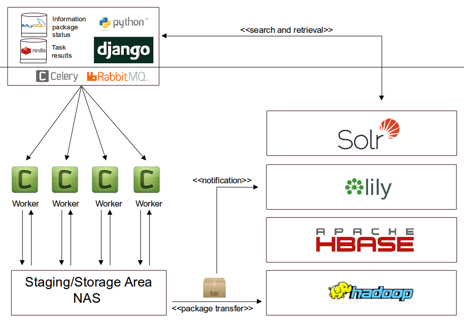
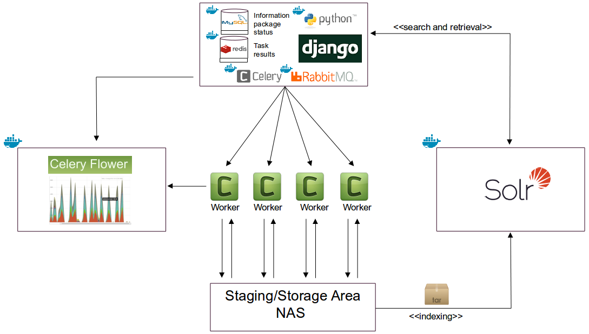

# earkweb

## Table of Contents

- [Instroduction](#instroduction)
- [Installation](#installation)
- [User guide](#user-guide)

## Instroduction

[E-ARK Web](https://github.com/eark-project/earkweb) is an open source archiving and digital preservation system. It is 
[OAIS](http://public.ccsds.org/publications/archive/650x0m2.pdf)-oriented which means that data ingest, archiving and dissemination functions operate on information packages 
bundling content and metadata in contiguous containers. The information package format uses [METS](http://www.loc.gov/standards/mets/) to represent the structure and 
[PREMIS](http://www.loc.gov/standards/premis/) to record digital provenance information. 

E-ARK Web offers functionality for the three types of information packages defined in the OAIS reference model: the Submission Information Package (SIP) which is the information 
sent from the producer to the archive, the Archival Information Package (AIP) which is the information stored by the archive, and the Dissemination Information Package (DIP) which 
is the information sent to a user when requested. The system allows executing different types of actions, such as information extraction, validation, or transformation operations, 
on information packages to support ingesting a SIP, archiving an AIP, and creating a DIP from a set of AIPs.

E-ARK Web consists of a frontend web application together with a task execution system based on [Celery](http://www.celeryproject.org) which allows synchronous and asynchronous 
processing of information packages by means of processing units which are called “tasks”. 

The backend can also be controlled via [remote command execution](./docs/user_guide_remotetask.md) without using the web frontend. The outcomes of operations performed by a task 
are stored immediately so that the status information in the frontend's database can be updated afterwards. 

## Installation

* [Manual installation](./docs/install_manual.md) 
* [Installing using Docker](./docs/install_docker.md)
* [Installation as WSGI app (Apache Webserver frontend)](./docs/install_wsgi.md)
* [Developer notes](./docs/developer_notes.md)

## User guide

* [Web user interface guide](./docs/user_guide_webui.md)
* [Headless task execution (without gui)](./docs/user_guide_remotetask.md)

## Architecture overview

The E-ARK Web architecture is designed for efficiently processing, storing, and accessing very large data collections in terms of scalability, reliability, and cost. 
The system makes use of technologies like the [Apache Hadoop framework](http://hadoop.apache.org), [NGDATA's Lily repository](https://github.com/NGDATA/lilyproject), 
and the [Apache SolR search server](http://lucene.apache.org/solr/) allowing the repository infrastructure to scale-out horizontally. Using Hadoop, the number of 
nodes in a cluster is virtually unlimited and clusters may range from single node installations to clusters comprising thousands of computers. The following diagram 
gives an overview about this architecture:

The user interface represented by the box on top of the diagram is a [Python](https://www.python.org)/[Django](https://www.djangoproject.com)-based web application which allows  
managing the creation and transformation of information packages. It supports the complete archival package transformation pipeline, beginning with the creation 
of the Submission Information Package (SIP), over the conversion to an Archival Information Package (AIP), to the creation of the Dissemination Information Package (DIP) which is 
used to disseminate digital objects to the requesting user. Tasks can be assigned to Celery workers (green boxes with a "C") which share the same storage 
area and the result of the package transformation is stored in the information package’s working directory based on files. 

Once the creation of information packages is finished, they can be deployed to the Lily access repository. Lily is build on top of HBase, a NoSQL database 
that is running on top of Hadoop. Lily defines some data types where most of them are based on existing Java data types. Lily records are defined using these data types as compared 
to using plain HBase tables, which makes them better suited for indexing due to a richer data model. 
The Lily Indexer is the component which sends the data to the Solr server and keeps the index synchronized with the Lily repository. Solr neither reads data from HDFS nor writes 
data to HDFS. The index is stored on the local file system and optionally distributed over multiple cluster nodes if index sharding or replication is used. 

There is also a lightweight version of E-ARK Web where the large-scale storage backend (HDFS, HBase) is replaced by a conventional file system storage and the SolR search server
is a single instance SolR instead of a SolR Cloud deployment illustrated by the following diagram:

## NLP Natural Language Processing

E-ARK Web now offers NLP tools. Please check out the [NLP documentation] (./docs/nlp_documentation.md) if you are interested.
