# E-ARK Web - User guide

## Table of Contents

  - [SIP Creator](#sip-creator)
    - [Initialise SIP package creation](#initialise-sip-package-creation)
    - [Adding files to the SIP](#adding-files-to-the-sip)
    - [SIP creation process](#sip-creation-process)
      - [Start SIP creation process](#start-sip-creation-process)
      - [Task execution](#task-execution)
      - [Active SIP creation processes overview](#active-sip-creation-processes-overview)
  - [SIP to AIP conversion](#sip-to-aip-conversion)
      - [Start SIP to AIP conversion process](#start-sip-to-aip-conversion-process)
      - [SIP to AIP conversion tasks](#sip-to-aip-conversion-tasks)
      - [SIP to AIP conversion task execution](#sip-to-aip-conversion-task-execution)
      - [Active SIP to AIP conversion processes](#active-sip-to-aip-conversion-processes)
      - [Indexing and search in AIPs](#indexing-and-search-in-aips)
  - [AIP to DIP conversion](#aip-to-dip-conversion)
    - [Initialise AIP to DIP conversion](#initialise-aip-to-dip-conversion)
      - [Start AIP to DIP conversion process](#start-aip-to-dip-conversion-process)
      - [AIP to DIP conversion tasks](#aip-to-dip-conversion-tasks)
      - [AIP to DIP conversion task execution](#aip-to-dip-conversion-task-execution)
- [Public search](#public-search)
  - [Administration](#administration)
    - [Django administration](#django-administration)
    - [Flower](#flower)

## SIP Creator

A Submission Information Package (SIP) – as defined in the OAIS model – is an information package that is delivered by a producer to the OAIS for use in the construction or update 
of one or more Archival Information Packages (AIPs).

The SIP Creator is a web-based interface allowing the creation of E-ARK Submission Information Packages (SIPs). Files can be uploaded to the corresponding sections (content, 
documentation and metadata) of the container and a set of tasks allows transforming the SIP into the required format.

### Initialise SIP package creation

In the  step it is required to provide a package name for the SIP:

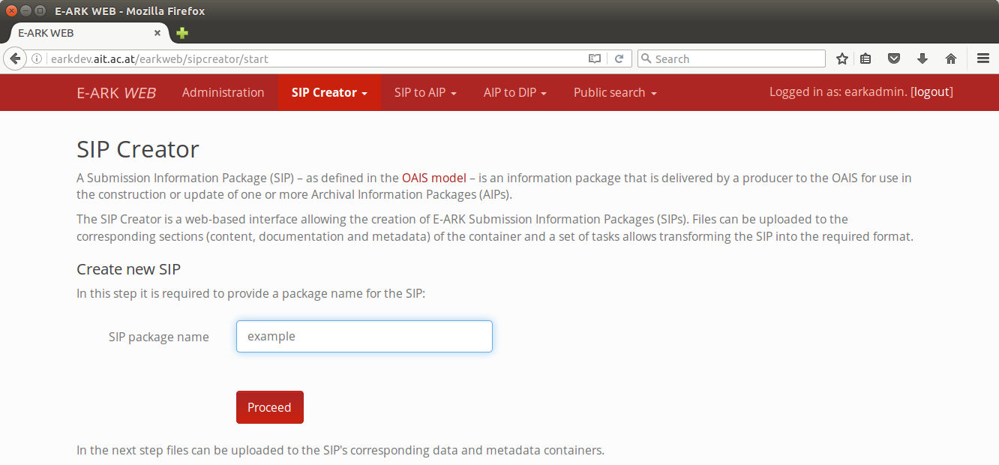

Note that a package name must have at least 3 characters.

Click on 'Proceed' to continue with the next step.

### Adding files to the SIP

A web formular allows uploading files to the corresponding areas of the SIP.

In the E-ARK SIP, each representation - as a set of files needed to render an intellectual entity - is stored in a separate directory under the "representations" directory.

It is required to give a name to the representation which will be used as the name of the directory where the actual data, additional documentation, and schemas can be uploaded to.

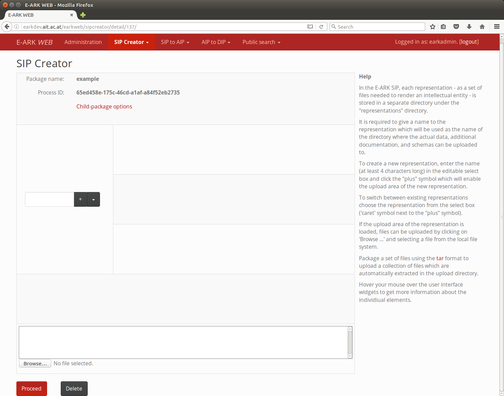

To create a new representation, enter the name (at least 4 characters long) in the editable select box and click the "plus" symbol which will enable the upload area of the new 
representation:

To switch between existing representations choose the representation from the select box ('caret' symbol next to the "plus" symbol).

If the upload area of the representation is loaded, files can be uploaded by clicking on 'Browse ...' and selecting a file from the local file system.

Package a set of files using the tar format to upload a collection of files which are automatically extracted in the upload directory.

Hover your mouse over the user interface widgets to get more information about the individiual elements.

Click on the "Proceed" button to continue with the next step.

### SIP creation process

#### Start SIP creation process

The SIP creation process interface allows executing SIP creation tasks:

* SIPReset
* SIPDescriptiveMetadataValidation
* SIPPackageMetadataCreation
* SIPPackaging
* SIPClose

#### Task execution

The tasks in the pull-down menue near the lable "Tasks" appear in the logical order in which they should be executed.

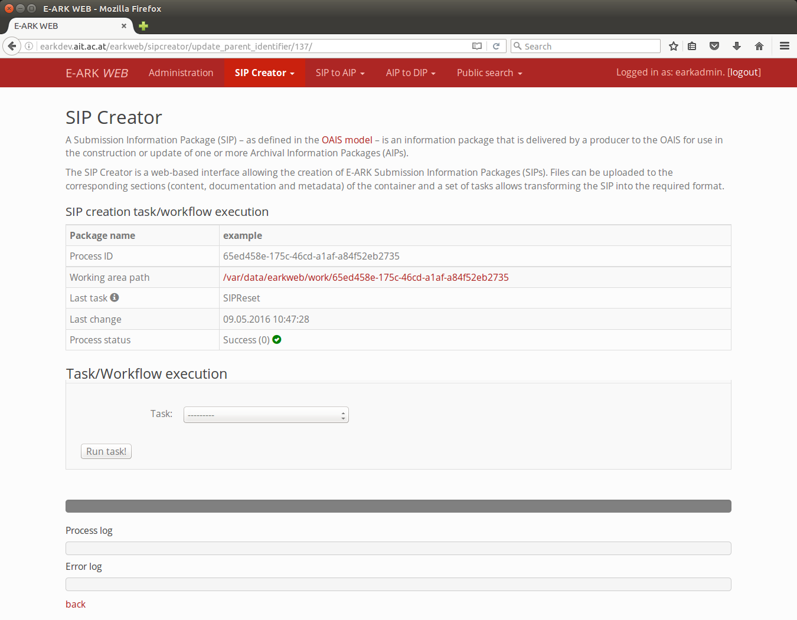

The "SIP creation task/workflow execution" overview table shows information entities of the package:

* The "Package name" is the name of the SIP which is the outcome of the current SIP creation process.
* The "Process ID" is a UUID which shows corresponds to the name of the working area directory. 
* The "Working area path" is a link which allows accessing the working area directory of the corresponding package to see the result of a task execution.
* The "Last task" shows the last task which was executed, e.g. "SIPValidation". The last task also determines the following task which can be executed because each task defines
a list of accepted input tasks.
* Last change is the date/time of the last modification (by a task)
* Process status shows the consistency status of a package. If the process status shows the value "Success (0)" together with a green "check mark" symbol, then the status of the 
package is consistent.If an error occurred during processing,the process status shows the value "Error (1)" together with a green "warning triangle" symbol.

Selected information and error log messages appear in the "Process log" and "Error log" areas, more detailed information about the processing might be available in the earkweb
processing log which is available in the package.

Use the "SIPReset" task to roll-back package processing to the initial state in case an error occurred during processing (after applying required modifications).

It is possible to directly continue with the "SIP to AIP conversion" process by executing the "SIP Close" task. Note that in this case the package disappears from the 
"Active SIP creation processes" overview page as it is handed over to the "SIP to AIP conversion". 

#### Active SIP creation processes overview

By accessing the sub-menu item "Active SIP creation processes", an overview about open SIP creation processes is shown. Each package is identified by the package name 
(column 'Package name') which was provided in the first step of the SIP creation process and an internal process identifier (column 'Process ID'). The process identifier is also 
used as the name of the working directory where information package transformations take place (column 'SIP creation working directory').

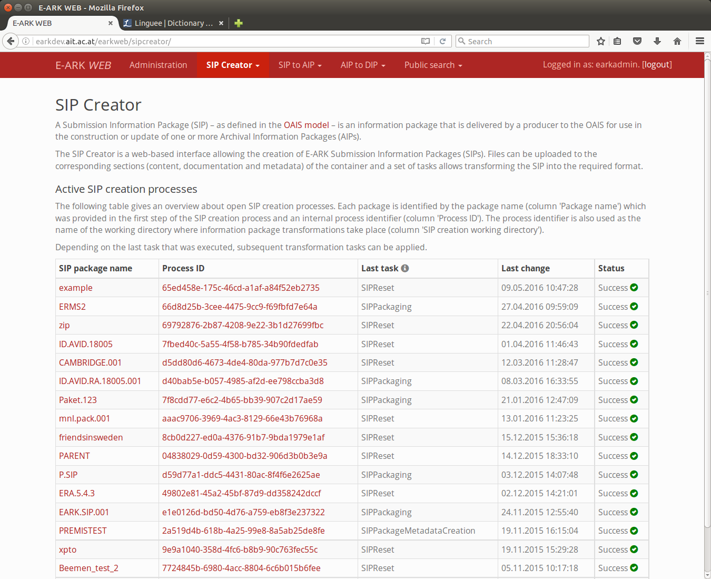

Depending on the last task that was executed, subsequent transformation tasks can be applied.

## SIP to AIP conversion

The AIP – as defined in the OAIS reference model – is an information package used to transmit and/or store archival objects within a digital repository. An AIP contains both, 
structural and descriptive metadata about the content, as well as the actual content itself.

The SIP to AIP conversion is a set of tasks that can be performed to convert an E-ARK SIP to an E-ARK AIP which both must comply with structural and metadata requirements defined 
by the E-ARK project.

#### Start SIP to AIP conversion process

The "SIP to AIP conversion" is either started by handing the package over from the "SIP creation" process within *earkweb* by executing the "SIP Close" task or it can be uploaded 
using the "SIP to AIP conversion" sub-menu item "Upload SIP":

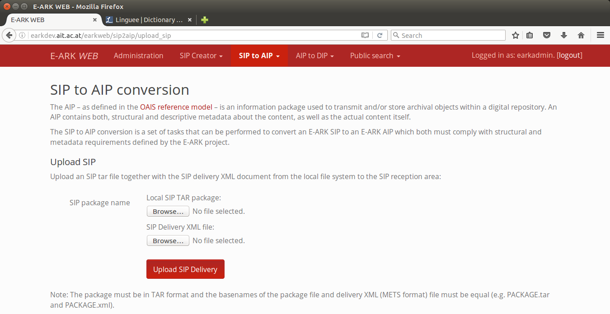

The TAR or ZIP container file of an SIP is uploaded together with the SIP delivery XML document from the local file system to the SIP reception area.

Note that the package must be in TAR or ZIP format and the basenames of the package file and delivery XML (METS format) file must be equal (e.g. PACKAGE.tar and PACKAGE.xml).

#### SIP to AIP conversion tasks

The SIP to AIP conversion process interface allows executing SIP creation tasks:

* SIPtoAIPReset - Rollback to initial state (as after handover from SIP creation or uploading the SIP) 
* SIPDeliveryValidation - Validate delivery (especially checksum information)
* IdentifierAssignment - Assign identifier
* SIPExtraction - Extract SIP
* SIPRestructuring - Restructure SIP according to AIP format
* SIPValidation - Validate SIP
* AIPMigrations - Do migrations according to predefined rules (e.g. PDF to PDF/A)
* AIPCheckMigrationProgress - Check if migrations are finisehd
* CreatePremisAfterMigration - Create PREMIS file after migrations completed
* AIPRepresentationMetsCreation - Create representation METS files
* AIPPackageMetsCreation - Create AIP METS and PREMIS
* AIPValidation - Validate package
* AIPPackaging - Create package container file
* AIPStore - Store AIP package in file system storage area (pairtree storage)
* AIPIndexing - Index AIP
* LilyHDFSUpload - Upload AIP to public search server

#### SIP to AIP conversion task execution

The tasks in the pull-down menue near the lable "Tasks" appear in the logical order in which they should be executed.

The "SIP to AIP task/workflow execution" overview table shows information entities of the package. Note that some information entities, such as "identifier" might appear only 
after a specific task ("IdentifierAssignment") in this case, was executed.

* The "Process ID" is a UUID which shows corresponds to the name of the working area directory. 
* The "Package name" is the name of the SIP which is the outcome of the current SIP creation process.
* The package Identifier is the PUID of the AIP. Although of type UUID in the reference implementation, this could be any other type of identifier, such as a DOI or PURL. 
* The "Working area path" is a link which allows accessing the working area directory of the corresponding package to see the result of a task execution.
* The "Last task" shows the last task which was executed, e.g. "AIPValidation". The last task also determines the following task which can be executed because each task defines
a list of accepted input tasks.
* Last change is the date/time of the last modification (by a task)
* Process status shows the consistency status of a package. If the process status shows the value "Success (0)" together with a green "check mark" symbol, then the status of the 
package is consistent.If an error occurred during processing,the process status shows the value "Error (1)" together with a green "warning triangle" symbol.

Selected information and error log messages appear in the "Process log" and "Error log" areas, more detailed information about the processing might be available in the earkweb
processing log which is available in the package.

Use the "SIPtoAIPReset" task to roll-back package processing to the initial state in case an error occurred during processing (after applying required modifications).

#### Active SIP to AIP conversion processes

By accessing the sub-menu item "Active SIP to AIP conversion processes", an overview about open SIP to AIP conversion processes is shown. Each package is identified by the package name 
(column 'Package name') which corresponds to the name of the SIP container. The process identifier is also used as the name of the working directory where information package 
transformations take place (column 'SIP creation working directory').

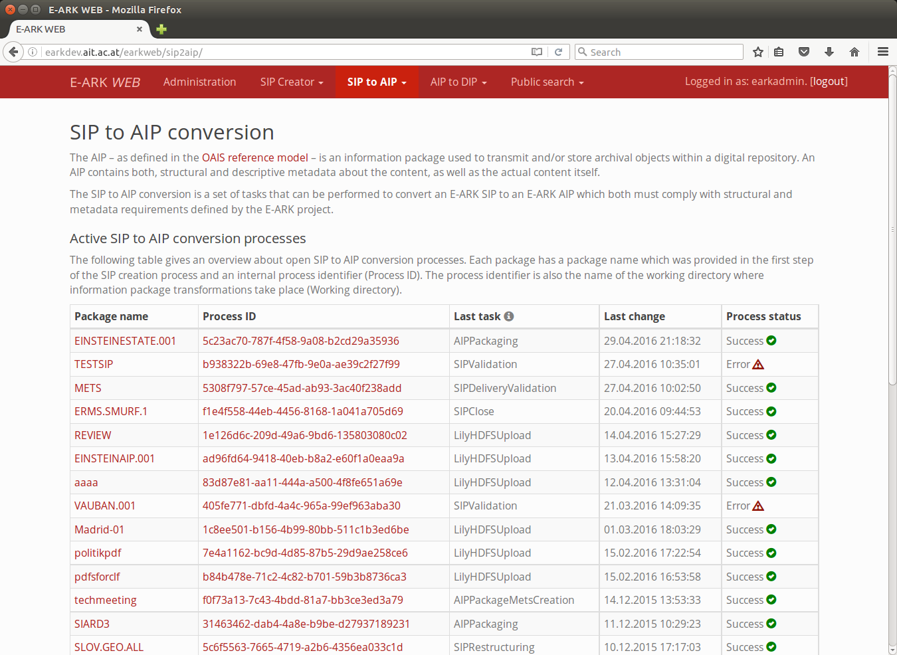

Depending on the last task that was executed, subsequent transformation tasks can be applied.

#### Indexing and search in AIPs

The "AIPIndexing" task allows indexing the AIP TAR package created the SIP to AIP conversion process. The AIP is indexed according to the location in the pairtree storage. By that 
way the search results can offer a link to directly render individual content items.

## AIP to DIP conversion

The Dissemination Information Package (DIP) – as defined in the OAIS reference model – is the information package which is received by the consumer in response to a request for content.

The AIP to DIP conversion is a set of tasks that can be performed to convert one or several E-ARK AIPs to an E-ARK DIP.

### Initialise AIP to DIP conversion

In the  step it is required to provide a package name for the DIP:

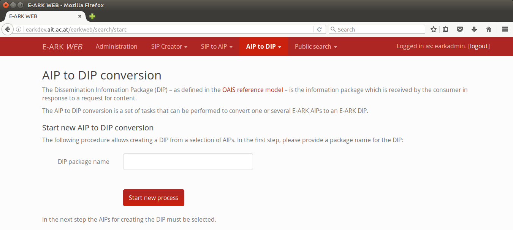

Note that a package name must have at least 3 characters.

Click on 'Proceed' to continue with the next step.

#### Start AIP to DIP conversion process

The "AIP to DIP conversion" is started by selecting AIPs from the AIP repository:

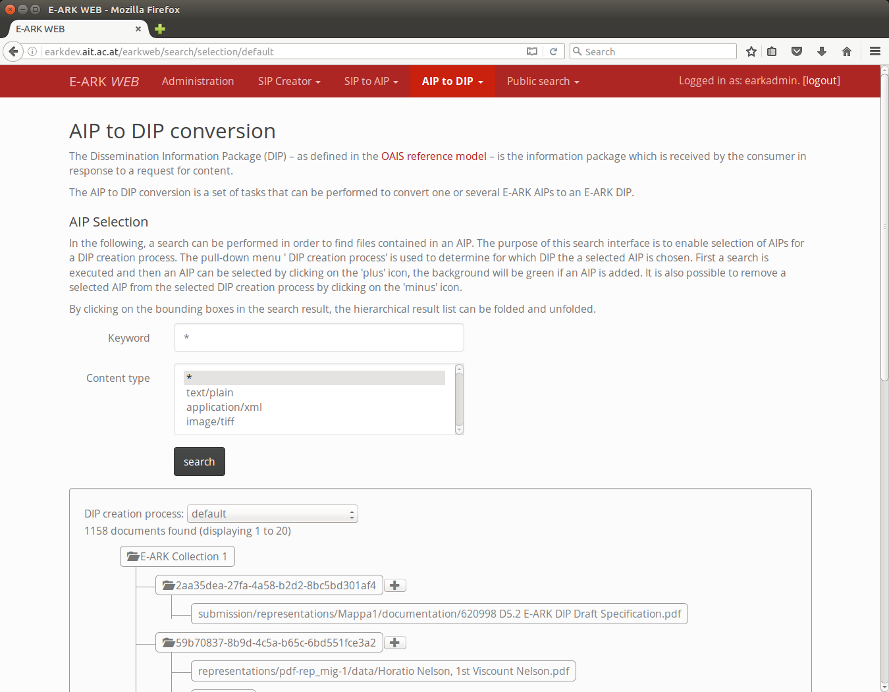
 
Alternatively, AIPs can be directly uploaded using the "File upload" in the task execution interface. 

Note that the AIP package must be in TAR format (ZIP is not supported).

#### AIP to DIP conversion tasks

The AIP to DIP conversion process interface allows executing AIP to DIP conversion tasks:

* AIPtoDIPReset - Rollback to initial state 
* DIPAcquireAIPs - Acquire selected packages from their corresponding storage locations
* DIPExtractAIPs - Extract AIPs
* DIPImportSIARD - Import SIARD files

#### AIP to DIP conversion task execution

The tasks in the pull-down menue near the lable "Tasks" appear in the logical order in which they should be executed.

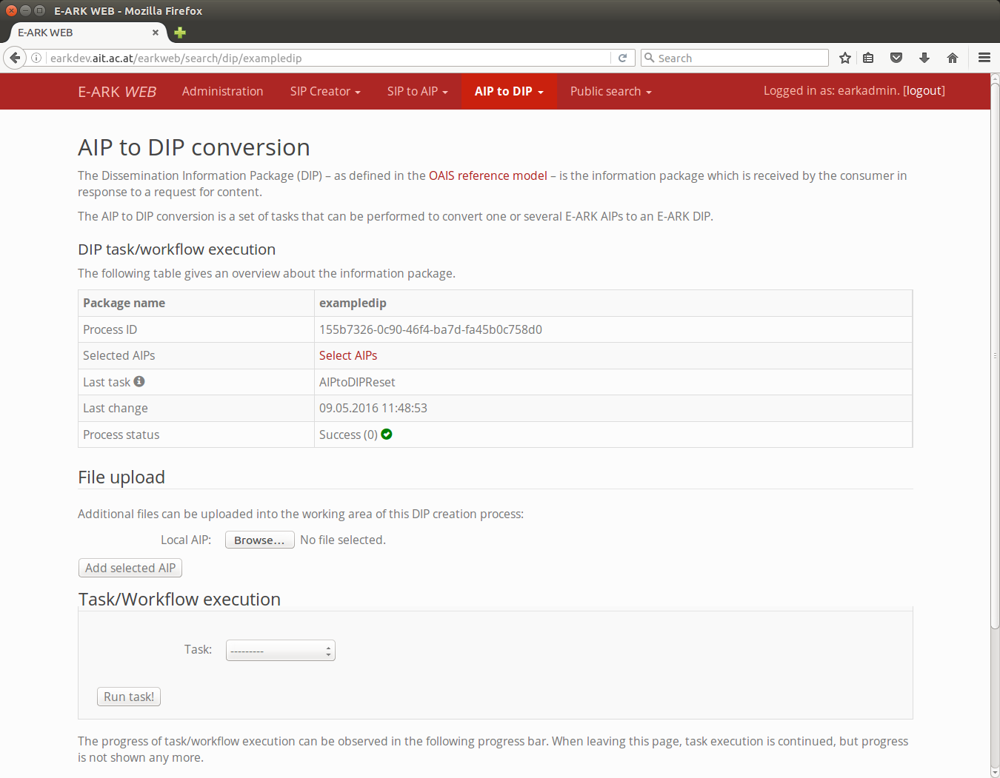

The "DIP task/workflow execution" overview table shows information entities of the package. 

* The "Package name" is the name of the DIP which is the outcome of the current SIP creation process.
* The "Selected AIPs" is a list of AIPs which is selected to create the DIP.
* The "Process ID" is a UUID which shows corresponds to the name of the working area directory. 
* The "Last task" shows the last task which was executed, e.g. "DIPAcquireAIPs". The last task also determines the following task which can be executed because each task defines
a list of accepted input tasks.
* Last change is the date/time of the last modification (by a task)
* Process status shows the consistency status of a package. If the process status shows the value "Success (0)" together with a green "check mark" symbol, then the status of the 
package is consistent.If an error occurred during processing,the process status shows the value "Error (1)" together with a green "warning triangle" symbol.

Selected information and error log messages appear in the "Process log" and "Error log" areas, more detailed information about the processing might be available in the earkweb
processing log which is available in the package.

Use the "AIPtoDIPReset" task to roll-back package processing to the initial state in case an error occurred during processing (after applying required modifications).

# Public search

The public search interface allows full-text search in the information packages which were released for public search.

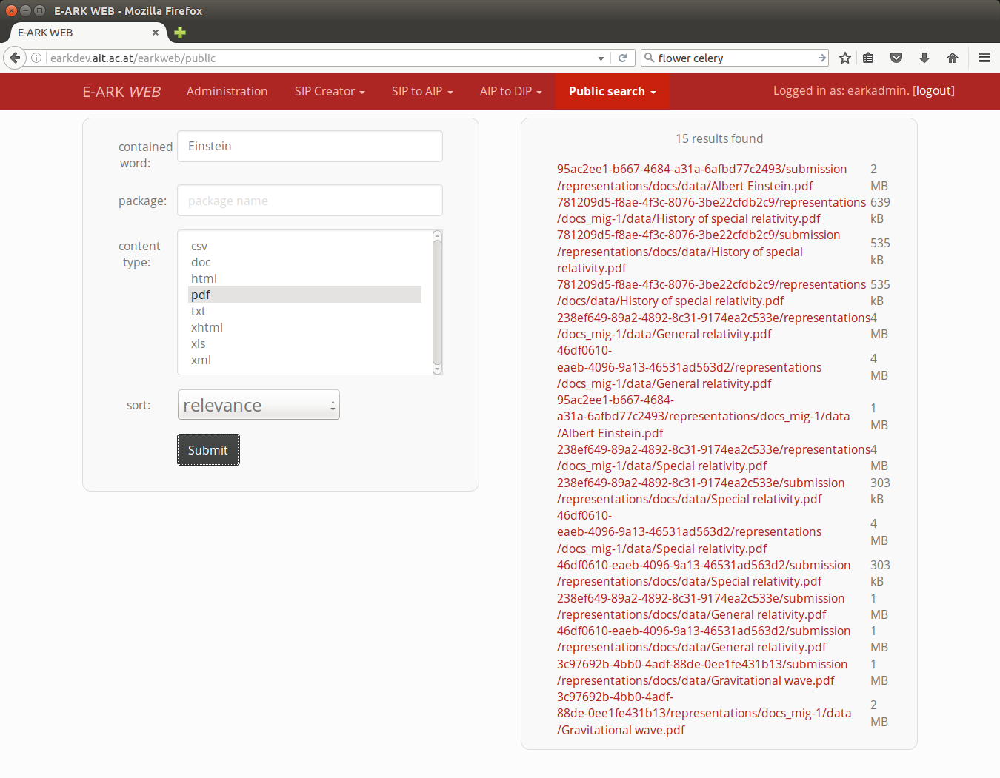

It allows filtering search results by indicating a search term or values for additional fields, such as "package" or "content type".

The result links point directly to the repository so that it is possible to view the file.

## Administration

### Django administration

*earkweb* is based on the [[Django framework|https://docs.djangoproject.com]] which provides an admin interface. It reads metadata from the models to provide a quick, model-centric 
interface where trusted users can manage content. 

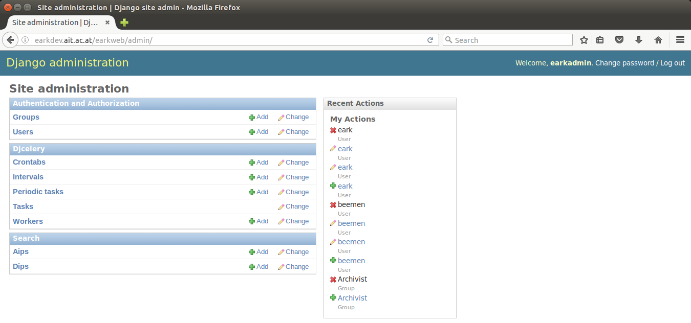

### Flower

*Flower* is a real-time monitor and web admin for Celery distributed task queue. It is recommended to install and set-up this application in a productive environment to be able
to monitor the execution of large numbers of tasks.