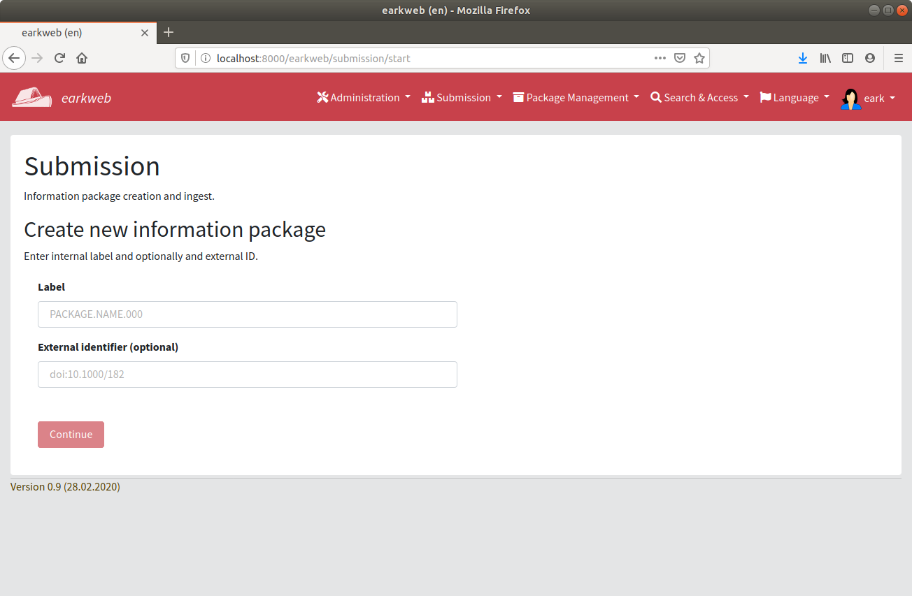
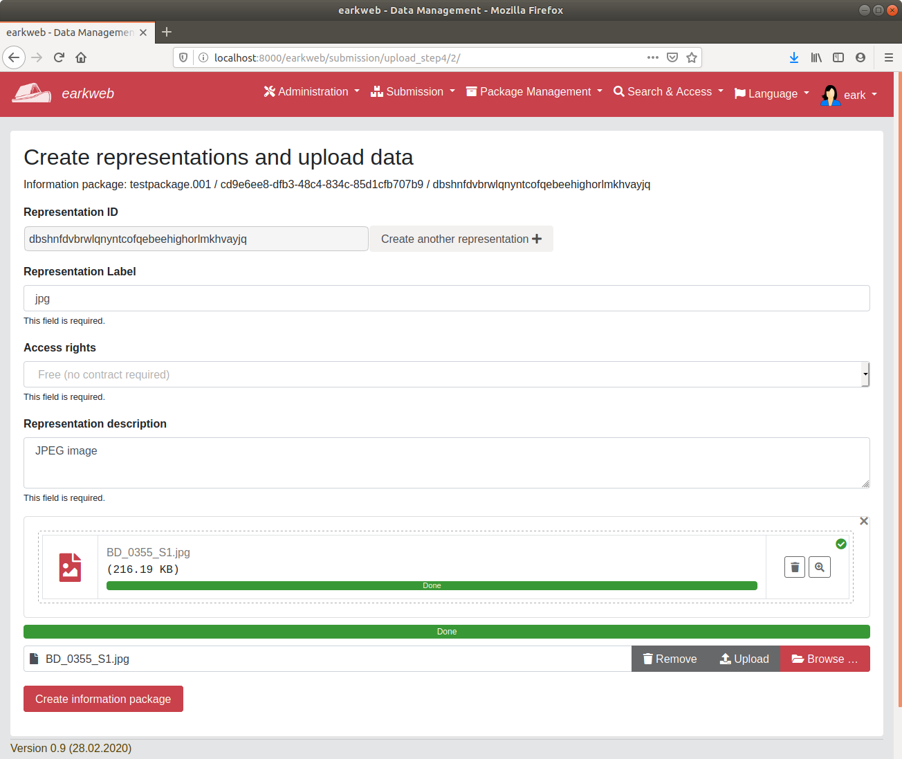

# User guide

## Introduction

__Information packages__ are data containers which are packaged as transferable entities and which can be provided 
via different transfer methods, such as Hypertext Transfer Protocol (HTTP), File Transfer Protocol 
(FTP) or Torrent. 

The __information package__ consists of the __data__ itself  and the __metadata__ 
related to it. On the one hand, the __data__ can contain different representations, i.e. the same data 
in different formats, such as a data table in Comma Separated Values (CSV) and PDF, for example. 
And, on the other hand, the __metadata__ contains basic information about the information package, 
such as the title, description, publisher, contact point, topic, keywords, etc. Additionally, there 
can be other metadata, e.g. regarding the _provenance_, i.e. when was the information package 
created or changed and by whom, or regarding the _digital preservation_, i.e. what actions have 
been taken to ensure long-term accessibility.

A simplified example of the structure of the information package package could be presented as follows:

    ,-------------------------------------------------------.
    | Information Package                                   |
    |-------------------------------------------------------|
    | - METS.xml                                            | <--- Structural metadata
    | - metadata/                                           | 
    |     - descriptive/EAD.xml                             | <--- Descriptive metadata
    |     - preservation/PREMIS.xml                         | <--- Preservation metadata
    |-------------------------------------------------------|
    | - representations/                                    | <--- Representations
    |     - pdf_representation/                             |
    |         - data/                                       |
    |             - file1.pdf                               |
    |             - file2.pdf                               |
    |         - metadata/                                   |
    |     - csv_representation/                             |
    |         - data/                                       |
    |             - file1.csv                               |
    |             - file2.csv                               |
    |         - metadata/                                   |
    `-------------------------------------------------------'

### User interface

The system is Python/Django-based web application which uses a MySQL database for storing information about 
information packages and a Celery/RabbitMQ/Redis backend for asynchronous task processing.

After installing the software, the application can be accessed using a web browser (`host` and `port` needs to be adapted
accordingly):

    http://<host>:<port>/earkweb 

You will be redirected to the login screen where you can login with your user credentials.

After logging in, the earkweb start page will be shown.

Navigate to "Submissions" / "Create new information package" to start a submission information packag creation. Enter a 
label for the package (only alpha-numeric ASCII characters and numbers, dot ('.') and hypen 
('-') allowed). Optionally, an external identifier can reference an existing identifier of the package.

Introduce an _information package title_ and _description_ and click on "Continue" to go to the next step.

Provide a contact point with the corresponding e-mail address, a publisher with the corresponding e-mail address, and 
the main language of the information package.

Click on "Continue" to go to the next step.

The next screen shows the first representation of the information package. An identifier for the representation 
(Representation ID) has been created automatically. Enter label, access rights and description of the first 
representation, and start uploading data files. The user interface allow placing files by "Drag & Drop". After selecting 
data files click on "Upload" to transfer the files to the represenation's data directory within the information package.

 
Click on "Create another representation" to add a representation of the data in another format. It is possible to
switch between representations, delete representations, and remove data files from representations.

Click on "Create information package" to go to the next step.

Review the information package and click on "Archive information package" 
to proceed to the next step or click on "Edit information package" to modify it.

You can now start the ingest of the information package, i.e. archiving it by clicking on 
"Archive information package". Note that the processing and monitoring backend 
needs to be available. 

The ingest process consists of a series of steps for creating the AIP. If any of the steps fails, this
will be shown by a red symbol next to the corresponding processing step. The following error was 
provoked by removing the "metsHdr" element from the METS.xml of the submission information package
so that it becomes invalid. 

Click on the link of the processing step to inspect the details of process execution.

The error message says "Error validating package METS file." and refers to the processing
log for details. 

The processing log file named "processing.log" is created in the root of the working directory. It 
shows details about the validation and reveals the actual error 

    "Element '{http://www.loc.gov/METS/}dmdSec': This element is not expected. Expected is ( {http://www.loc.gov/METS/}metsHdr ). (<string>, line 0)" 

The following screen shows the successful execution of the ingest pipeline. 

After archiving the information package is listed in the "Package management" area.

Once the information package is archived, it receives a __Unique Identifier (UID)__ which is used to 
identify the information package throughout its life-cycle. The following is an example of such an identifier based on 
UUID[uuid](#uuid):

    urn:uuid:cmchfbsurejmrfyjevhcsfhxinaijwxnjmpixrzl
    
In the last step of the ingest workflow the information package is indexed.
The full-text search can be used to find content stored in information packages 

and directly access it (if the file size does not exceed a configurable limit).

## Administration

### Django administration

The web application is based on the [Django framework](https://docs.djangoproject.com) which provides an admin interface. It 
reads metadata from the models to provide a quick, model-centric interface where administrators can manage content. 

### Flower

*Flower* is a real-time monitor and web admin for Celery distributed task queue. It is recommended to install and 
set-up this application in a productive environment to be able
to monitor the execution of large numbers of tasks.

In the development environment, flower can be started using the following command:

    celery flower -A earkweb --address=127.0.0.1 --port=5555
    
If the flower service is available in a sub-path (e.g. http://127.0.0.1/flower), then a URL prefix needs to be defined:

    celery flower -A earkweb --address=127.0.0.1 --url_prefix=flower --port=5555

<a name="uuid">uuid</a> https://tools.ietf.org/html/rfc4122
